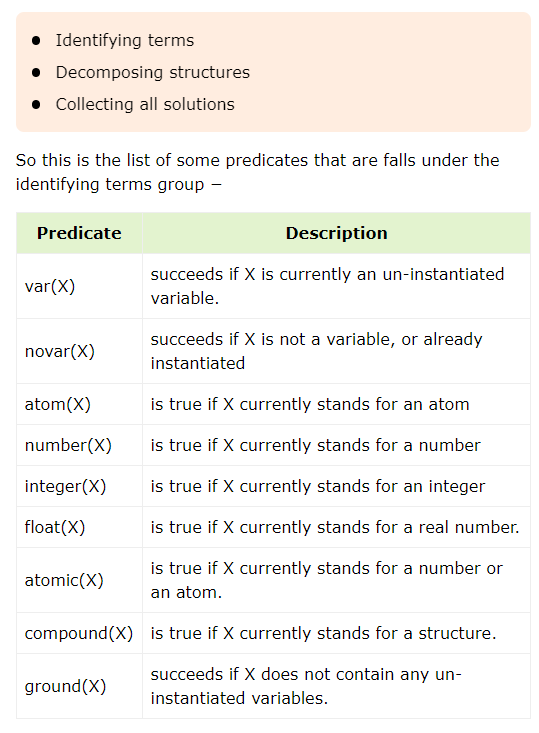
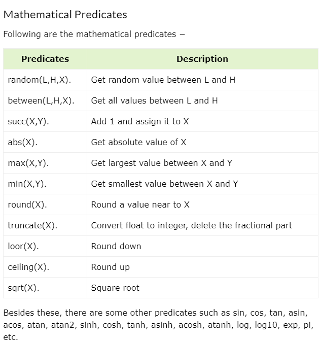
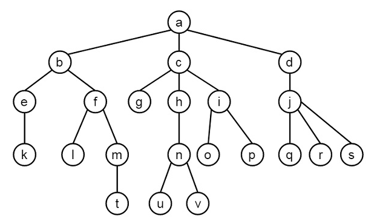

# Resumen del Reporte de Práctica 4 con Prolog

## Introducción
Prolog es un lenguaje de programación lógica utilizado en inteligencia artificial y lingüística computacional. Es un lenguaje declarativo donde la programación se realiza mediante declaraciones de hechos y reglas.

## Curso de Prolog

### Introducción
La programación lógica se diferencia de la programación tradicional en que se proporciona una base de conocimientos y la máquina encuentra respuestas basadas en esa base, a diferencia de los pasos específicos que siguen los algoritmos en la programación funcional.

### ¿Qué es Prolog?
Prolog es un lenguaje lógico y declarativo adecuado para programas que implican cálculos simbólicos o no numéricos, como en la inteligencia artificial.

#### Elementos de Prolog
- **Hechos:** Predicados que son verdaderos.
- **Reglas:** Extensiones de hechos con cláusulas condicionales.
- **Preguntas:** Utilizadas para ejecutar el programa y obtener respuestas.

#### Aplicaciones de Prolog
- Recuperación de bases de datos inteligentes
- Comprensión del lenguaje natural
- Lenguaje de especificación
- Aprendizaje automático
- Planificación de robots
- Sistemas de automatización
- Resolución de problemas

### Environment Setup
Prolog se puede instalar en el siguiente link http://www.gprolog.org/ en Windows, Mac & Linux

### Hello World
Para escribir "Hello World" en Prolog:
```
write('Hello World').
```
> Después de cada línea, debe usar un símbolo de punto (.) para mostrar que la línea ha terminado.
> Antes de ejecutar el archivo *.pl, debemos almacenar el archivo en el directorio donde apunta la consola de GNU Prolog.

## Crear y Ejecutar un Programa Prolog
Cree un archivo con extensión `.pl` y escriba el siguiente código:

```
main :- 
    write('This is sample Prolog program'),
    write(' This program is written into hello_world.pl file').

```

Para ejecutar utilice:
```
[hello_world].
```

## Conceptos Básicos
### Hechos
Un hecho es una relación explícita entre objetos y propiedades que son incondicionalmente verdaderos.
#### Pautas para escribir hechos
- Los nombres de propiedades/relaciones comienzan con letras minúsculas.
- El nombre de la relación aparece como primer término.
- Los objetos aparecen como argumentos separados por comas entre paréntesis.
- Un punto (.) debe poner fin a un hecho.
- Los objetos también comienzan con letras minúsculas.

```
Sintaxis:
relation(object1, object2, ...).
```

```
Ejemplo
cat(tom).
loves_to_eat(kunal, pasta).
of_color(hair, black).
loves_to_play_games(nawaz).
lazy(pratyusha).
```

#### REGLAS
Una regla es una relación implícita entre objetos, condicionalmente verdadera.


```
Sintaxis:
rule_name(object1, object2, ...) :- fact/rule(object1, object2, ...).
P :- Q;R.   % se entiende como: P :- Q. P :- R.
P :- Q,R;S,T,U.  % se entiende como: P :- (Q,R);(S,T,U).

```

```
Ejemplo:
happy(lili) :- dances(lili).
hungry(tom) :- search_for_food(tom).
friends(jack, bili) :- lovesCricket(jack), lovesCricket(bili).
goToPlay(ryan) :- isClosed(school), free(ryan).
```

#### Consultas (QUERIES)
Las consultas son preguntas sobre relaciones entre objetos y propiedades.

```
Ejemplo:
girl(priya).
girl(tiyasha).
girl(jaya).
can_cook(priya).
```

## Relaciones

```
female(pam).
female(liz).
female(pat).
female(ann).
male(jim).
male(bob).
male(tom).
male(peter).
parent(pam, bob).
parent(tom, bob).
parent(tom, liz).
parent(bob, ann).
parent(bob, pat).
parent(pat, jim).
parent(bob, peter).
parent(peter, jim).

mother(X, Y) :- parent(X, Y), female(X).
father(X, Y) :- parent(X, Y), male(X).
haschild(X) :- parent(X, _).
sister(X, Y) :- parent(Z, X), parent(Z, Y), female(X), X \== Y.
brother(X, Y) :- parent(Z, X), parent(Z, Y), male(X), X \== Y.
```


Output:
```
| ?- [family].
| ?- parent(X, jim).
X = pat ;
X = peter

| ?- mother(X, Y).
X = pam, Y = bob ;
X = pat, Y = jim ;

| ?- haschild(X).
X = pam ;
X = tom ;
X = bob ;
X = pat ;
X = peter

| ?- sister(X, Y).
X = liz, Y = bob ;
X = ann, Y = pat ;
X = pat, Y = ann ;
```

#### Recursión en la relación familiar
Estas relaciones son de naturaleza estática. También podemos crear algunas relaciones recursivas.

```
predecessor(X, Z) :- parent(X, Z).
predecessor(X, Z) :- parent(X, Y), predecessor(Y, Z).
```

Ouput:
```
| ?- [family_rec].
| ?- predecessor(peter, X).
X = jim ;
no
| ?- trace.
| ?- predecessor(bob, X).
X = ann ;
X = pat ;
X = peter ;
X = jim ;
```

## Objeto de datos
Los átomos son una variación de las constantes. Pueden ser cualquier nombre u objeto. Hay algunas reglas que se deben seguir cuando intentamos utilizar Atoms como se indica a continuación

* azahar
* b59
* b_59
* b_59AB
* b_x25
* antara_sarkar

**Cadenas de caracteres especiales**  
Ejemplos:
* <--->
* =======>
* ...
* .:.
* ::=

**Cadenas de caracteres entre comillas simples**

Esto es útil si queremos tener un átomo que comience con mayúscula. Al encerrarlo entre comillas, lo distinguimos de las variables.
* ‘Rubai'
* ‘Arindam_Chatterjee'
* ‘Sumit Mitra'

**Números**

Prolog también admite números reales, pero normalmente el caso de uso de números de punto flotante es mucho menor en los programas Prolog, porque Prolog es para cálculos simbólicos y no numéricos.

**Las variables se encuentran en la sección Objetos simples**

Las variables se pueden utilizar en muchos de estos casos en nuestro programa Prolog, que hemos visto anteriormente. Entonces existen algunas reglas para definir variables en Prolog.

Podemos definir variables de Prolog, de modo que las variables sean cadenas de letras, dígitos y caracteres de subrayado. Comienzan con una letra mayúscula o un carácter de subrayado.

* X
* Sum
* Memer_name
* Student_list
* Shoppinglist
* _a50
* _15

**Variables anónimas en PROLOG**

Las variables anónimas no tienen nombre. Las variables anónimas en el prólogo se escriben con un solo carácter de subrayado '_'. Y una cosa importante es que cada variable anónima individual se trata como diferente. No son iguales.

Ahora la pregunta es, ¿dónde deberíamos utilizar estas variables anónimas?

Supongamos que en nuestra base de conocimientos tenemos algunos datos: "jim odia a tom", "pat odia a bob". Entonces, si Tom quiere saber quién lo odia, puede usar variables. Sin embargo, si quiere comprobar si hay alguien que lo odia, podemos utilizar variables anónimas. Entonces, cuando queremos usar la variable, pero no queremos revelar el valor de la variable, podemos usar variables anónimas.

```prolog
hates(jim,tom).
hates(pat,bob).
hates(dog,fox).
hates(peter,tom).
```
Output:
```
yes
| ?- hates(X,tom).

X = jim ? ;

X = peter

yes
| ?- hates(_,tom).

true ? ;

(16 ms) yes
| ?- hates(_,pat).

no
| ?- hates(_,fox).

true ? ;

no
| ?-
```

#### Operadores

**Comparación de operadores en Prolog**

Los operadores de comparación se utilizan para comparar dos ecuaciones o estados.
Ejemplo:

```
| ?- 1+2=:=2+1.

yes
| ?- 1+2=2+1.

no
| ?- 1+A=B+2.

A = 2
B = 1

yes
| ?- 5<10.

yes
| ?- 5>10.

no
| ?- 10=\=100.

yes
```

**Operadores aritméticos en Prolog**
Los operadores aritméticos se utilizan para realizar operaciones aritméticas.

Ejemplo:
```
calc :- X is 100 + 200,write('100 + 200 is '),write(X),nl,
        Y is 400 - 150,write('400 - 150 is '),write(Y),nl,
        Z is 10 * 300,write('10 * 300 is '),write(Z),nl,
        A is 100 / 30,write('100 / 30 is '),write(A),nl,
        B is 100 // 30,write('100 // 30 is '),write(B),nl,
        C is 100 ** 2,write('100 ** 2 is '),write(C),nl,
        D is 100 mod 30,write('100 mod 30 is '),write(D),nl.
```
Output
```
| ?- change_directory('D:/TP Prolog/Sample_Codes').

yes
| ?- [op_arith].
compiling D:/TP Prolog/Sample_Codes/op_arith.pl for byte code...
D:/TP Prolog/Sample_Codes/op_arith.pl compiled, 6 lines read - 2390 bytes written, 11 ms

yes
| ?- calc.
100 + 200 is 300
400 - 150 is 250
10 * 300 is 3000
100 / 30 is 3.3333333333333335
100 // 30 is 3
100 ** 2 is 10000.0
100 mod 30 is 10

yes
| ?-
```

## Ciclos y toma de decisiones
Los operadores aritméticos se utilizan para realizar operaciones aritméticas.

Ejemplo:
```prolog
count_to_10(10) :- write(10),nl.
count_to_10(X) :-
   write(X),nl,
   Y is X + 1,
   count_to_10(Y).
```
Output
```
(16 ms) yes
| ?- count_to_10(3).
3
4
5
6
7
8
9
10

true ?
yes
| ?-
```


#### Toma de decisiones
Las declaraciones de decisión son declaraciones If-Then-Else. 

Sintaxis:
```
If <condition> is true, Then <do this>, Else 
```

Ejemplo:
```
% If-Then-Else statement

gt(X,Y) :- X >= Y,write('X is greater or equal').
gt(X,Y) :- X < Y,write('X is smaller').

% If-Elif-Else statement

gte(X,Y) :- X > Y,write('X is greater').
gte(X,Y) :- X =:= Y,write('X and Y are same').
gte(X,Y) :- X < Y,write('X is smaller').
```
Output: 
```
yes
| ?- gt(10,100).
X is smaller

yes
| ?- gt(150,100).
X is greater or equal

true ?

yes
| ?- gte(10,20).
X is smaller

(15 ms) yes
| ?- gte(100,20).
X is greater

true ?

yes
| ?- gte(100,100).
X and Y are same

true ?

yes
| ?-
```

####  Conjunciones y disyunciones

**Conjunciones**

La conjunción (lógica Y) se puede implementar utilizando el operador coma (,). Así, dos predicados separados por coma se unen con la declaración AND. Supongamos que tenemos un predicado `parent(jhon, bob)`, que significa "Jhon es padre de Bob", y otro predicado `male(jhon)`, que significa "Jhon es masculino". Podemos crear otro predicado `padre(jhon, bob)`, que significa "Jhon es padre de Bob". Definimos el predicado `padre` cuando es padre Y es varón.

**Disyunciones**

La disyunción (lógica OR) se puede implementar utilizando el operador punto y coma ;. Así, dos predicados separados por punto y coma se unen con una declaración OR. Supongamos que tenemos un predicado `padre(jhon, bob)`, que dice "Jhon es padre de Bob", y otro predicado `madre(lili, bob)`, que dice "Lili es madre de Bob". Si creamos otro predicado como `niño()`, esto será cierto cuando `padre(jhon, bob)` sea verdadero O `madre(lili, bob)` sea verdadero.

Ejemplo:
```
parent(jhon,bob).
parent(lili,bob).

male(jhon).
female(lili).

% Conjunction Logic
father(X,Y) :- parent(X,Y),male(X).
mother(X,Y) :- parent(X,Y),female(X).

% Disjunction Logic
child_of(X,Y) :- father(X,Y);mother(X,Y).
```
Output:
```
yes
| ?- father(jhon,bob).

yes
| ?- child_of(jhon,bob).

true ?

yes
| ?- child_of(lili,bob).

yes
| ?-
```
#### Listas

**Representación de listas**

Las listas son estructuras de datos simples comúnmente usadas en programación no numérica. Pueden contener cualquier cantidad de elementos, como por ejemplo: rojo, verde, azul, blanco y oscuro. Estas listas se representan entre corchetes, por ejemplo, `[rojo, verde, azul, blanco, oscuro]`.

Una lista puede ser vacía o no vacía. En el primer caso, se representa como un átomo de Prolog, `[]`. En el segundo caso, la lista tiene dos partes:

- La cabeza de la lista, que es su primer elemento.
- La cola de la lista, que es el resto de los elementos.

Por ejemplo:
- `[a, b, c] = [x | [b, c]]`
- `[a, b, c] = [a, b | [c]]`
- `[a, b, c] = [a, b, c | []]`

#### Recursividad y Estructura

**Recursividad**

La recursividad implica que un predicado se utilice a sí mismo (junto con otros predicados si es necesario) para determinar su verdad.

```
is_digesting(X,Y) :- just_ate(X,Y).
is_digesting(X,Y) :- just_ate(X,Z), is_digesting(Z,Y).
```

**Estructuras de Datos**

Las estructuras son entidades que almacenan información en múltiples partes.

Por ejemplo, una fecha puede considerarse como una estructura con tres elementos: día, mes y año. Así, la fecha 9 de abril de 2020 se puede representar como: `fecha(9 de abril de 2020)`.

**Coincidencia en Prolog**

La coincidencia se emplea para verificar si dos términos dados son idénticos o si las variables en ambos términos pueden referirse a los mismos objetos después de instanciarse. Aquí tienes un ejemplo:

Digamos que la estructura de fechas está definida como `fecha(D,M,2020) = fecha(D1,abr, Y1)`. Esto indica que `D = D1`, `M = abr`, y `Y1 = 2020`.

Utilizaremos las siguientes reglas para verificar si dos términos `S` y `T` coinciden.

**Árboles Binarios**
```
node(2, node(1,nil,nil), node(6, node(4,node(3,nil,nil), node(5,nil,nil)), node(7,nil,nil))
```
Cada nodo tiene tres campos, datos y dos nodos. Un nodo sin estructura secundaria (nodo hoja) se escribe como nodo (valor, nulo, nulo), el nodo con un solo hijo izquierdo se escribe como nodo (valor, nodo_izquierdo, nulo), el nodo con solo un hijo derecho se escribe como nodo (valor, nulo; nodo_derecho), y el nodo con ambos hijos tiene un nodo (valor, nodo_izquierdo, nodo_derecho).

#### Retroceso (Backtracking)

El concepto de retroceso es ampliamente utilizado en el diseño de algoritmos y en varios entornos de programación. En Prolog, el proceso de retroceso implica que el programa intenta deshacer pasos previos hasta que alcanza la solución correcta. Una vez que encuentra esa solución, se detiene el proceso.

Ejemplo:
```
boy(tom).
boy(bob).
girl(alice).
girl(lili).

pay(X,Y) :- boy(X), girl(Y).
```
Output:
```
yes
| ?- pay(X,Y).

X = tom
Y = alice ?

(15 ms) yes
| ?- pay(X,Y).

X = tom
Y = alice ? ;

X = tom
Y = lili ? ;

X = bob
Y = alice ? ;

X = bob
Y = lili

yes
| ?- trace.
The debugger will first creep -- showing everything (trace)

(16 ms) yes
{trace}
| ?- pay(X,Y).
   1 1 Call: pay(_23,_24) ?
   2 2 Call: boy(_23) ?
   2 2 Exit: boy(tom) ?
   3 2 Call: girl(_24) ?
   3 2 Exit: girl(alice) ?
   1 1 Exit: pay(tom,alice) ?
   
X = tom
Y = alice ? ;
   1 1 Redo: pay(tom,alice) ?
   3 2 Redo: girl(alice) ?
   3 2 Exit: girl(lili) ?
   1 1 Exit: pay(tom,lili) ?
   
X = tom
Y = lili ? ;
   1 1 Redo: pay(tom,lili) ?
   2 2 Redo: boy(tom) ?
   2 2 Exit: boy(bob) ?
   3 2 Call: girl(_24) ?
   3 2 Exit: girl(alice) ?
   1 1 Exit: pay(bob,alice) ?
   
X = bob
Y = alice ? ;
   1 1 Redo: pay(bob,alice) ?
   3 2 Redo: girl(alice) ?
   3 2 Exit: girl(lili) ?
   1 1 Exit: pay(bob,lili) ?
X = bob
Y = lili

yes
{trace}
| ?-
```

#### Diferente y No.

Aquí vamos a definir dos predicados: diferente y no. El predicado diferente verifica si dos argumentos dados son iguales o no. Si son iguales, devuelve falso; de lo contrario, devuelve verdadero. Por otro lado, el predicado no se utiliza para negar una afirmación. Esto significa que si una afirmación es verdadera, entonces not(afirmación) será falsa; de lo contrario, si la afirmación es falsa, entonces not(afirmación) será verdadera.

Entonces, el concepto de "diferente" se puede expresar de tres maneras distintas, como se muestra a continuación.

Ejemplo:
```
different(X, X) :- !, fail.
different(X, Y).
```
Output:
```

yes
| ?- different(100,200).

yes
| ?- different(100,100).

no
| ?- different(abc,def).

yes
| ?- different(abc,abc).

no
| ?-
```

## Entradas y Salidas
Hasta este momento, hemos observado cómo escribir un programa y realizar consultas en la consola para su ejecución. En ocasiones, mostramos información en la consola que está previamente definida en nuestro código de Prolog. Ahora exploraremos más a fondo las operaciones de escritura y lectura utilizando Prolog. Estas técnicas corresponden al manejo de entradas y salidas.

**The Write() predicate**
Ejemplo:
```
| ?- write(56).
56

yes
| ?- write('hello').
hello

yes
| ?- write('hello'),nl,write('world').
hello
world

yes
| ?- write("ABCDE")
.
[65,66,67,68,69]

yes
```

**The read() Predicate**
Ejemplo:
```prolog
cube :-
   write('Write a number: '),
   read(Number),
   process(Number).
process(stop) :- !.
process(Number) :-
   C is Number * Number * Number,
   write('Cube of '),write(Number),write(': '),write(C),nl, cube.
```

**The tab() Predicate**
Ejemplo:
```prolog
| ?- write('hello'),tab(15),write('world').
hello          world

yes
| ?- write('We'),tab(5),write('will'),tab(5),write('use'),tab(5),write('tabs').
We    will  use   tabs

yes
| ?-
```

**Reading/Writing Files**

Comandos:
```prolog
| ?- told('myFile.txt').
uncaught exception: error(existence_error(procedure,told/1),top_level/0)
| ?- told("myFile.txt").
uncaught exception: error(existence_error(procedure,told/1),top_level/0)
| ?- tell('myFile.txt').

yes
| ?- tell('myFile.txt').

yes
| ?- write('Hello World').

yes
| ?- write(' Writing into a file'),tab(5),write('myFile.txt'),nl.

yes
| ?- write("Write some ASCII values").

yes
| ?- told.

yes
| ?-
```

Output en myFile.txt
```
Hello World Writing into a file     myFile.txt
[87,114,105,116,101,32,115,111,109,101,32,65,83,67,73,73,32,118,97,108,117,101,115]
```

**Manipulando caracteres**
Con las funciones read() y write() podemos leer o escribir el valor de átomos, predicados, cadenas, etc. En esta sección, exploraremos cómo escribir caracteres individuales en el flujo de salida actual y cómo leer desde el flujo de entrada actual. Para realizar estas tareas, existen algunos predicados predefinidos.

Ejemplo:
```
| ?- put(97),put(98),put(99),put(100),put(101).
abcde

yes
| ?- put(97),put(66),put(99),put(100),put(101).
aBcde

(15 ms) yes
| ?- put(65),put(66),put(99),put(100),put(101).
ABcde

yes
| ?-put_char('h'),put_char('e'),put_char('l'),put_char('l'),put_char('o').
hello

yes
| ?-
```

## Predicados Integrados.

**Descomposición de Estructuras**
Vamos a explorar otro grupo de predicados integrados que se encargan de descomponer estructuras. Anteriormente, hemos trabajado con términos identificativos. Sin embargo, al usar estructuras compuestas, no es posible utilizar una variable para verificar o crear un functor, ya que esto provocará un error. Por lo tanto, el nombre del functor no puede ser representado mediante una variable.



Ejemplo:
```
X = tree, Y = X(maple).
Syntax error Y=X<>(maple)
```




## Arbol de estructura de datos (Case study)

- op(500, xfx, ‘is_parent’).
- op(500, xfx, ‘is_sibling_of’).
- op(500, xfx, ‘is_at_same_level’).
- And another predicate namely leaf_node(Node)
- a is_parent b, or is_parent(a, b). So this indicates that node a is the parent of node b.
- X is_sibling_of Y or is_sibling_of(X,Y). This indicates that X is the sibling of node Y. So the rule is, if another node Z is parent of X and Z is also the parent of Y and X and Y are different, then X and Y are siblings.
- leaf_node(Node). A node (Node) is said to be a leaf node when a node has no children.
- X is_at_same_level Y, or is_at_same_level(X,Y). This will check whether X and Y are at the same level or not. So the condition is when X and Y are same, then it returns true, otherwise W is the parent of X, Z is the parent of Y and W and Z are at the same level.

Ejemplo:
```
/* The tree database */

:- op(500,xfx,'is_parent').

a is_parent b. c is_parent g. f is_parent l. j is_parent q.
a is_parent c. c is_parent h. f is_parent m. j is_parent r.
a is_parent d. c is_parent i. h is_parent n. j is_parent s.
b is_parent e. d is_parent j. i is_parent o. m is_parent t.
b is_parent f. e is_parent k. i is_parent p. n is_parent u.
n 
is_parent v.
/* X and Y are siblings i.e. child from the same parent */

:- op(500,xfx,'is_sibling_of').

X is_sibling_of Y :- Z is_parent X,
                     Z is_parent Y,
                     X \== Y.
leaf_node(Node) :- \+ is_parent(Node,Child). % Node grounded

/* X and Y are on the same level in the tree. */

:-op(500,xfx,'is_at_same_level').
X is_at_same_level X .
X is_at_same_level Y :- W is_parent X,
                        Z is_parent Y,
                        W is_at_same_level Z.
```

Output:
```

yes
| ?- i is_parent p.

yes
| ?- i is_parent s.

no
| ?- is_parent(i,p).

yes
| ?- e is_sibling_of f.

true ?

yes
| ?- is_sibling_of(e,g).

no
| ?- leaf_node(v).

yes
| ?- leaf_node(a).

no
| ?- is_at_same_level(l,s).

true ?

yes
| ?- l is_at_same_level v.

no
| ?-
```

**Más de estructura de datos**

Consideremos el mismo árbol aquí.

We will define other operations −
* path(Node)
* locate(Node)
* path(Node) − This will display the path from the root node to the given node. To solve this, suppose X is parent of Node, then find path(X), then write X. When root node ‘a’ is reached, it will stop.
* locate(Node) − This will locate a node (Node) from the root of the tree. In this case, we will call the path(Node) and write the Node.

Ejemplo:
```
path(a).                             /* Can start at a. */
path(Node) :- Mother is_parent Node, /* Choose parent, */
              path(Mother),          /* find path and then */ 
              write(Mother),
              write(' --> ').
              
/* Locate node by finding a path from root down to the node */
locate(Node) :- path(Node),
                write(Node),
                nl.
```